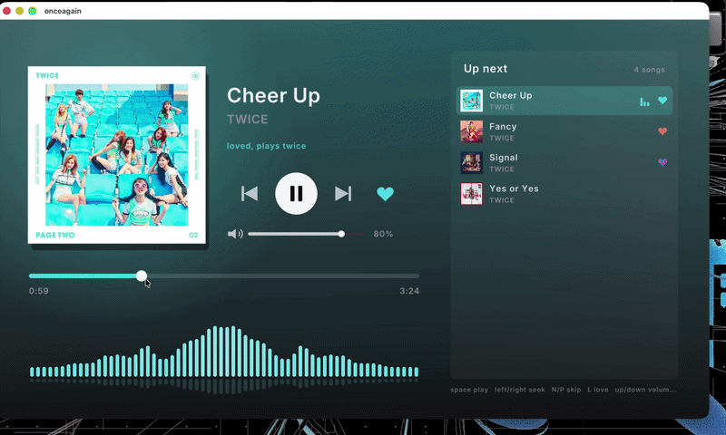

# onceagain

A sleek in-car style music player written in C++20 with raylib.
Songs you love get played twice (an encore), because once is never enough.



## Features

- Now Playing screen with album art, theme color pulled from the cover art, live spectrum visualizer
- Love a song and it plays one more time when it ends, with a "ONCE AGAIN" badge
- Queue panel with thumbnails, click to play, scroll wheel
- Keyboard controls that map to steering wheel style buttons
- Debug overlay showing buffer fill and audio underruns

## How it works

Three threads:

```
main (ui) --commands--> streamer thread --lock-free ring buffer--> audio thread
                                                                        |
main (ui) <---------- visualizer ring buffer (mono samples) ------------+
```

- **UI thread** renders at 60 fps and sends play / seek commands under a mutex
- **Streamer thread** decodes the file and fills a lock-free SPSC ring buffer
- **Audio thread** (raylib callback) pulls samples from the ring. It never locks or allocates, so a slow UI frame can't cause audio glitches
- Seeking or switching songs asks the audio thread to drain the ring, since only the consumer is allowed to move the read index
- The ring buffer has a 5 million item two-thread stress test (`tests/ring_test.cpp`), clean under ThreadSanitizer

## Build

```
cmake -S . -B build
cmake --build build
ctest --test-dir build
./build/onceagain
```

Run it from the repo root so it finds `music/` and `assets/`.

## Adding music

Put your own audio files in `music/` named `Artist - Title.mp3` (mp3, wav, ogg).
For cover art, add a PNG with the same name: `Artist - Title.png`.
The music folder is gitignored so no songs end up in the repo.

## Controls

| Key | Action |
| --- | --- |
| Space | play / pause |
| Left / Right | seek 5s |
| N / P | next / previous |
| L | love (plays twice) |
| Up / Down | volume |
| D | debug overlay |
